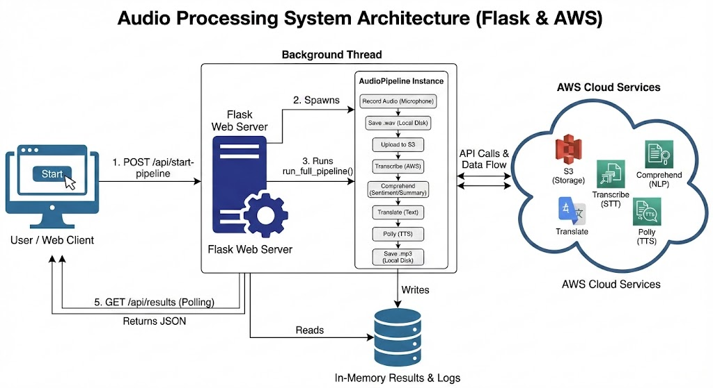

# NOTIFY

# Audio Processing Pipeline with AWS

This project is a Flask-based web application that records audio locally, uploads it to AWS S3, and processes it through a pipeline of AWS services including Transcribe, Comprehend, Translate, and Polly.

## Features

- Local audio recording using sounddevice.
- Audio file storage on AWS S3.
- Speech-to-Text using AWS Transcribe.
- Sentiment analysis using AWS Comprehend.
- Text translation using AWS Translate.
- Text-to-Speech synthesis using AWS Polly.
- REST API for frontend integration.

## Prerequisites

1. Python 3.8 or higher.
2. An AWS Account with permissions for S3, Transcribe, Comprehend, Translate, and Polly.
3. System libraries for audio recording (PortAudio).

### Installing PortAudio
- **Windows:** Automatically handled by pip or install manually if needed.
- **macOS:** `brew install portaudio`
- **Linux (Ubuntu/Debian):** `sudo apt-get install libportaudio2`

## Installation

1. Install the required Python packages:
   
   pip install -r requirements.txt

2. Configuration:
   Open the main Python file and update the AWS configuration section with your credentials:

   AWS_ACCESS_KEY_ID = "YOUR_ACCESS_KEY"
   AWS_SECRET_ACCESS_KEY = "YOUR_SECRET_KEY"
   AWS_REGION = "us-east-1"
   BUCKET_NAME = "your-unique-bucket-name"

## Usage

1. Start the Flask server:
   
   python app.py

2. The server will start at http://127.0.0.1:5000.

3. API Endpoints:
   - POST /api/start-pipeline: Starts the recording and processing.
     JSON Body: {"duration": 5, "target_lang": "es"}
   - GET /api/logs: Retrives real-time processing logs.
   - GET /api/results: Retrieves final data (transcript, sentiment, links).
   - GET /api/audio/<filename>: Downloads generated MP3 or WAV files.

## Project Structure

- app.py: Main application logic and API routes.
- static/: Folder for serving static assets.
- templates/: HTML files for the frontend.
- requirements.txt: List of python dependencies.

## Troubleshooting

- If recording fails, ensure your microphone is set as the default input device in your OS settings.
- If AWS calls fail, check your IAM user permissions and ensure the S3 bucket exists in the specified region.
- If sounddevice fails to install, ensure PortAudio is installed on your system.